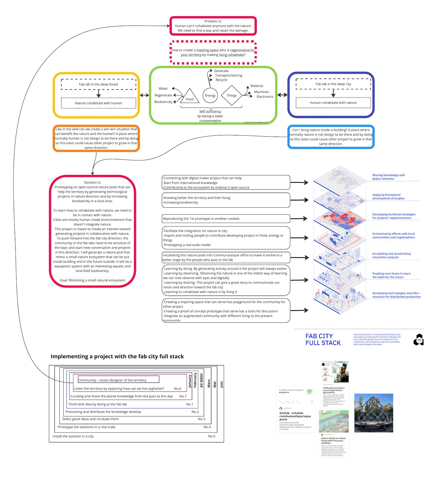

# What is the project

## Idea 1

In this world where we exclude the nature of our live, home, city, how can find a way to cohabitate with nature? How can we create space in our human environnement to invite again nature close to us and how in nature can we reintroduce human without harming?

## Idea 2
