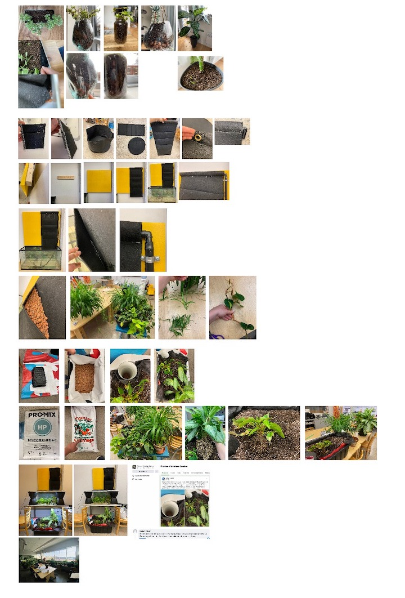

# Hosting a social network

## The problem

**How can we host the social network of the nature into our indoor environnement to increase our wellbeing and health**

The nature is a complex network that connect together the microbiome, the plants, the mushrooms and the animals. For thousand of years the human species evolve here, adapting and participating to this global social network.

Nowadays, 90% of our time is spend indoor. We have created environnement that detach us from nature completely influencing without knowing the human health , the diversity of the microbiome and the resilience of the ecosystem itself by changing the air composition. Scientist estimate that ''indoor area covers 1,3 to 6% of global ice-free land area'' and this number is growing very fast every year.

This global environnement problem can also be relate to our individual benefit. During the last decade, science had showed that nature have a positive effect on us influencing our mental and physical health. Our interior design can be change to increase our wellbeing.

How can we take advantage of those impressive statistic and how could we bring back this nature in those sterile man made indoor environnement? How to bring this complex social network of the nature.

By tackling this problem we could improve, globaly, the resilience of the ecosystems and locally, the human health.

## Who

**This project is putting in relationship the indoor spaces, the occupants, the social network around plants and the biomes that is generated by those main stakeholders.**

In general, we devide the living in 4 main families, the biomes, the plants, the fungi and the animals. In my point of view the complexe internetting relationship between those families is call nature. Has human, we can sens the nature benefit with our 5 senses (sight, smell, tasts, hear and touch). The biome is the main actor that can influence the smell, the taste and the touch. The plants and the environnement are the mains actors that can influence the sight and the hearing.

The biome is compose of microorganismes that can live on surfaces, in liquid or even in air. The composition of this biome is deeply influence by the weather and the living on a specific area, this is why we often link a biome with an ecological region.

The plants can adapt at a certain point to it's environnement, but depending of it's media and the weather condition, the plants will change it's physical aspect. (Different kind of roots, quantity of leafs, colors, emitting different gaz, etc.) Those physical aspect have an influence on the air composition around, the gaz sequestration in soils that will feed fungi and biome, the quantity of water and nutriments needed, the taste and smell of the plants and so on.

A plant itself could be consider has a neighborhood of biome and fungi that exchange food and services for the survival of all. Multiple plants link together could be consider has a city where plants can communicate, hear and even retain informations for a period of time. We should make sure that those plants that will be introduce indoor can keep this close social interaction, a living media and weather condition that will make them happy.

## Solution

**Implement multispecies desing in our indoor environement by helping the community to build customizable indoor living system that will help bring biodiversity and living interconnectivity**

Indoor environnement have plenty of lost spaces that could be offer has new homes to those micro-living world. We can use the corners of our buildings, wall surfaces, security accessories like ramps or wall division. We could treat it like a master piece that induce a mood in a room or reduce sound echo. We could use it to create discutions, inspiration or even enrich curiosity. Theirs are a millions ways to integrate nature indoor.

For the moment, plants are typically introduce indoor environnement in solo pot and people can multiply this solution for multiple plant. Everyone are still individual and the watering process could be tricky.

This solution need to be driven by the personnalisation, the same way a person design their interior to represent themselves in a certain way. By adapting the permaculture methodology to the indoor and by making this project open, hopefully the design system could be reproduce globally and the fabrication with the final shape could be adapt locally.

## Impact

**This project have an impact on human health, the air quality and the biodiversity**

Like in nature, a single action always cause a chain reaction of impacts. This project of customizing indoor environnement by hosting the social network of the nature, can create multiple impact on different level.

The direct and immediate impact acts directly on human health, physically and mentally by sensing the nature daily. Also the aerial biome in building will be more divers and so less illness for human and non humain stakeholders.

The undirect impact at this level is that by doing this project into your indoor environnement, you can reconnect to nature by observing again slow phenomenons, knowing better the needs of the livings, etc. The skills and the knowledge that we can learn can lead to other impacts like integrating some of your indoor plant outside, providing better car of your local outdoor ecosystem.

Inspired by the documentary planet boundaries, I like to think that people will produce mode food and plants for local productions. That could influence the pressure on the planet about the air pollution, the pressure on land and the biodiversity of course.

## Methodology use to develop this project

