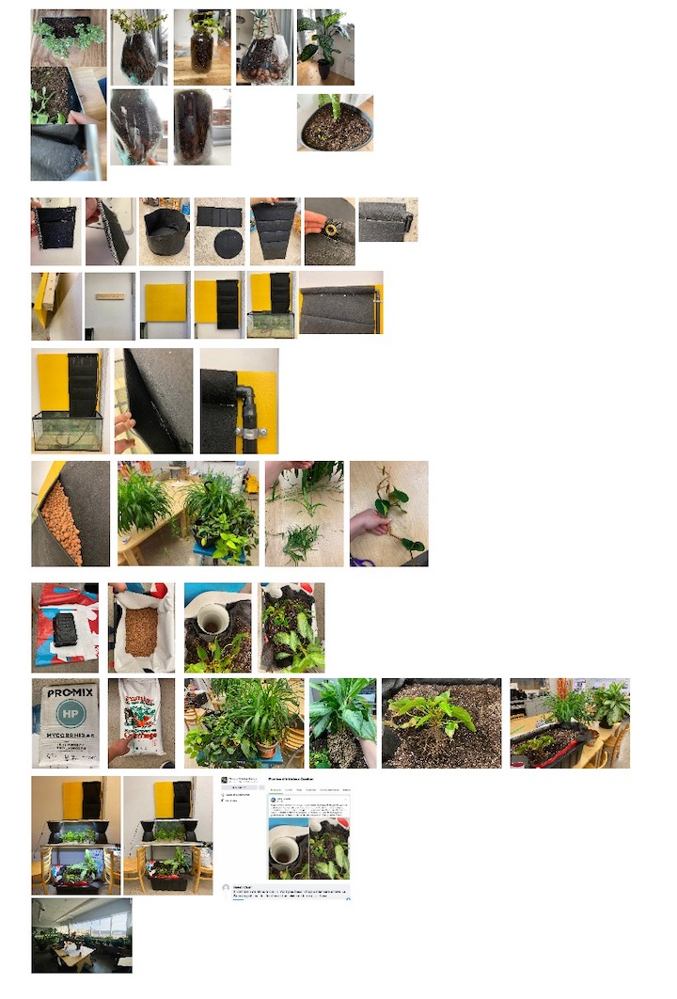

# What is the project

## Idea 1

In this world where we exclude the nature of our live, home, city, how can find a way to cohabitate with nature? How can we create space in our human environnement to invite again nature close to us and how in nature can we reintroduce human without harming? What could be the symbiosis between a fab lab in a deep city and a fab lab in a deep forest?

## Idea 2

How can we do a project with a local and a global ecosystem? Can we test it with a small aquaponic project in the kitchen of the lab? This map could be a exemple of the relationships between the stakeholders that could help incubate a project.

## Idea 3

One of our partener Terra Perma is experimenting different form of permaculture on his land in a deep forest. How can the human and non-human could live in symbiosis to cultivate food, having shelter and trive on the same land. Can we start doing permaculture indoor in the deep city? Can we transform our city in productive city that could help to regenerate a good biodiversity?

## Idea 4

In the pass we have made a aquaponic system in the lab to bring back nature indoor because we live 90% of our time in indoor spaces. Science had showed that nature have a real effect on human healt. Maybe if we reintegrate aquaponic system indoor we can start producing in the city and increase the biodiversity in the same time?  

## Idea 5

Here is the lab in the city of montreal and here is Terra Perma where they experiment permaculture and are surronding of deep forest. How can we increase biodiversity in the city by connecting the living togheter? How can we reintroduce the nature indoor and how to develop this sensitivity toward nature?

## Idea 6

The common direction between us is *Experiment with different forms of permaculture to regenerate biodiversity and produce varied yields locally* and one way to do it is to take the oportunity of those indoor environnement that are completely detach from nature. How can we do permaculture indoor and how could it help the biodiversity? The yields could be productive or not, it could be a relaxing space or producing herbes. It's a personalize process where the community can decide how to transform their indoor space and invite this community to meet other living community like plants or fishes. How can human and non-human community meet?

## Idea 7

First pitch of the project divided in the fab city full stack methodology. I have many reflexions on the relationship of the bioregion (wild) vs the same bioregion in city (with indoor AND outdoor air+environement)

## Idea 8

Reshaping the project divided in the fab city full stack methodology. How can we collectively reconect with our nature to receive it's benefice but also to recongnize it's good work and services? The human evolve in nature and our physical and mental health is link to it's environnement. Now we live in city where nature have difficulties to achives it's services and where we build many infrastructure to replace thoses services but ineficiantly.

## Idea 9

I ask the person of the lab to do an imagination exercice to understand emotionaly what is the nature mean for them, how they feel about having nature inside and how they can receive one benefit of the nature. I ask them to close their eye, open the door of their home and inside, theire's nature. What do they see? What are they feeling? Has you can see being in nature or the feeling to be in nature is very different depending of the person but everybody explain something desirable where they fill good in it. Maybe we can realize thoses wiches.

## Intervention 1

This first intervention is to test a way of practicing a permaculture methodology but indoor. A different way of using this outside methodology but now to reintroducing the nature indoor. 1- We begin to define collectively our yield. Do we want a relaxing place? do we want tomatos?... 2- Nature edges. Often the edges in nature is where we can find the most of the biodiversity. At the insersection of a fresh and salty current, at the edge of a river and the land... What are the edges we can benifit in the nature that we can answer our yield? 3-4-5 is to ment to go deeper in the system and see what will be the main stakeholder of the system and how do they work togheter? What are their role? And we finish the session by brainstroming name for our system.

This is the result of this mapping tool.

I made a digestable/readable summary of the results informations.

## Intervention 2

I reformat the summary informations to create a creative design sprint. The groupe had 2h to choose 1 yield, 1 edges, 1 substrat and 1 living environement and create a frankenstein prototype in the space to make their idea come alive.

We had 3 teams, 5 persons. 3 differents systems came out of this exercices, but all the system could be connected to each other.

## Reflexion

We have 5 senses, my hypothesis is that we can sens the benefit of nature by our 5 main sensors. If we integrate nature indoor a good way to verify the efficiency of the system is to check at least if our 5 human sensors can sens it. 

## Idea 10

After the workshop on the biome and their role, my project take another turn. It make all sens now. The biome is the microscopic world of organismes that are floating in the air, live on the surfaces and are responssible for so many things. They can act like biosensor because they appear when different chemical leave a trace. I start ready different papers on the indoor air compositions vs the outdoor air and the influence of your environnement that create this composition. My project is about inscreasing the biome diversity by the reintroduction and the connection of differents living toghetter. How can we host those connections, those relationships indoor to help human to have better air, reducing the bad influencers emission and increasing the good influencer emission so it can have a better biome biodiversity. Those indoor air have concentrated air for the moment so low number of entity but high in quantity. Those concentration air flow could contribute to unbalance the outdoor city air that could contribute to unbalance the bioregional air and so on. 1 indoor air don't have a global impact, but the multiplication of indoor air could reach a great global impact on the level and the quality of the biome. The invisible world is much more important that more important than what we think. This topic touch the agency and the biodiversity of the non-human, the health of the human and our education and sentivity toward the nature. We need to be humble and admit that human can not live without the help of the nature.

## Presentation **Hosting a social network**

**Video**

We need to change the way we built to create multispeacies design.

## Prototype

Base on what the community had done during the design sprint of the 2nd intervention, I tested different way of growing plant but togheter. The main solution to grow plant indoor, is having an unic plant in a single pot. But nature and biome is all about connectivity. How can we grow plants is a way that they can communicate of allow somekind of transportation system to connect the biome toghetter. So here is a prototype of plant pot on the floor that work it could have rain from the top and than water fill a water table under it. The other prototype is a felt pocket on the wall. One pocket with clay pebble, one pocket with some soil and one pocket with nothing inside. The baby plants come from around the building. In permacultur, you do with what you have arround. Some of those plant are following the lab for more than 8 years, they are part of the family already.

## Observation

During the Biotech workshop week, we create a brainstorming scientific study map that hightligh some keys topics helpfull for this project. Another observation is that nature effect can be provide by 2 categories. The earing and visual can be provide by the plants and the animals and the rest of our sens can benefit of the nature because of the biomes and the fungies.

## It could be a consulting methodology

We can see this project also like a new field. A consulting office where you do architectural or interior multispeacies design. You can create a diagnostic and integrate various 

## Community project 
**Discovering talents**

Going back to the beggining, how can non-human communities could meet eachother? One person of the community have a natural talent for reproducing plants, he realy like it and playing with plants is a sort of therapy for him. So he show me how he reproduce some plants by doing it togheter. In the middle of the conversation he had a great idea of creating a QR code that can provide some informations on how to care about the plant, what does she like or dislike, where to put her in the environnement, etc. I create a Kumu file connected to a google sheet (a tool well knowed by the community) so we can create a map or our stakeholders in the indoor environnement and in the same time can be use to know better our non-human teamates. This googles sheet can be fill by all the community members. In my point of view this kumu map have the faculty of taking big amount of informations and relation to visual and make it digestable for a person unrelated to the project or the hole map. It's a good way to have multilayer of informations. This QR code project was the first laser cutter projet of this Community member so he learn in the same time few digital manufacturing skills. Yiey! 

**Propagation skills**

Base on the previous event, we gather around the thematic of propagating. 3 members of the community show us differents ways to propagate differents speacies of plants. After, we pick some plants in the lab and try to propagates thems. All level of gardening skill where there and enrich the conversation. One of the member decide to create a slack chanel to communicate our progress of our newborn plants.

**Designing a pegboard wall for plants**

One member of the community is not so mutch into plants but have greater interest into the fabrication and design challenges. To develop the pegboard idea related during the intervention 2, we started to codesign this idea. Here is some sketches of the idea taking shape and some exploration he did to make it nice, usefull and parametrical for a reproduction purpose.

## Local action to a global impact
This local experimental project locally incubated have showed interest and curiosity. The local and the global network had demonstrate interest in this new field of meerging indoors spaces and the social network of the nature. This new field and or movement need to be open and colaborative because nobody have the answer and we just began to understand those network of informations. Maybe this project could help centralize the informations about multispiecies design to host them indoors to helps being inspired and further develop decentralize solutions. To scale the impact I will transform this process into a toolkit that we can follow has a base and invite a global participations to keep going foward collectively.