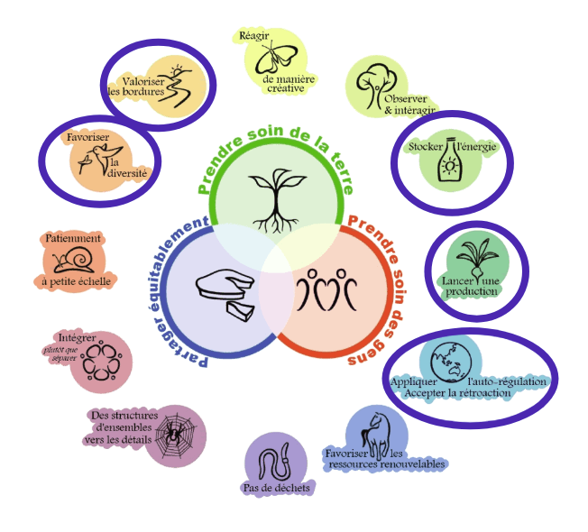

# Hosting a social network

We evolve in the nature. We where receiving each day the benefit of the nature through our 5 senses;  sight, touch, smell, taste and hearing.

Nowaday, we are evolving in indoor spaces, where we spend 90% of our time. Those indoors space don't give the same benefit has the nature. For exemple, if we compare outdoor air with indoor air, the outdoor have greater diversity of micro-organismes and the concentration of each element is very low. Indoor air, on the other hand, have less source of emitter so the air is compose of fewer elements but are in the space in a greater quantity.  This composition of air put you in higher risk of sickness.

Nature is not a individual plant. Nature is multiple complex relationship with plants, mirco-organismes, fungi and animal. How can we reintroduce this nature inside human construction? This project is exploring one way to do it.

By adapting the permaculture methodology to the indoor environnement we could, all together, find different ways to do so and that will respect your limitations, your needs and the changes over the years. The goal here is to give you a methodology that could be reproduce globally and the fabrication with the final shape could be adapt locally.

*For more information you can read:*
*Analysing indoor mycobiomes through a large-scale citizen science study in Norway* [*marine traffic*](https://pubmed.ncbi.nlm.nih.gov/33830574/)
*Sources of airborne microorganisms in the built environment* [*indoor biome*](https://microbiomejournal.biomedcentral.com/articles/10.1186/s40168-015-0144-z#:~:text=Likewise%2C%20pets%20and%20plants%20are,mold%20growing%20on%20building%20materials)
*The aerobiome uncovered: Multi-marker metabarcoding reveals potential drivers of turn-over in the full microbial community in the air* [*aerobiome*](https://www.sciencedirect.com/science/article/pii/S0160412021001768)
*Evolution of the indoor biome* [*evolution*](https://www.sciencedirect.com/science/article/abs/pii/S0169534715000385)

## 1- Map your environnement

This first step is to analyse your present environnement. The more diversity of living you have, beter it is and if the material around you emit polutants, we need to absorbe those or change habbit. Gather the persons who consume the space and the owner of this space and start your steps.

So first, map your environnement and identify :
1. All the livings (human and non-human)
2. The materials that compose your indoor space
3. The place where you have water or humidity
4. If you have ventilation system or some filter
5. Your habits that could bring some outside element indoors.

You can do it with a big sheet of paper or you can do it with *Kumu* [Kumu link ](https://kumu.io) and link a google sheet

## 2- What is your "Yield"

This is the diagram of the traditional methodology of outside permaculture. We will start by the one in circles.

A yield could be something like having herbs but it could be also like having a peacefull space. What do you want to produce in you indoor space? What are your goals?

## 3- Design from edges

In nature, the edges are always seen like opportunity for life. What edges in nature can respond to your yield and that can be use hase a primary inspiration to host your social network?

## 4-Invite and get to know your guests

Always create with what you already have in your surrounding. What plants or living that you can introduce and or propagate that you can get along with. Investigate what your new living need to be happy and thriving. If you are using Kumu and google sheet, you can add the information there.

## 5-Adjust your design and make it

Now that you know better your new guests, adjust your design for their needs. Build your first multispecies system that will be integrated to your environnement. If you need help don't hesitate to contact us or reach to your peers.

## 6-Install it

Congratulation! it's time to install your system and the living in it.

## 7-Observe & adjust

Observe your system and try to see if theirs are any problems during the first 6 weeks. Be ampatic toward your plants. Do you thinck there happy? if not, make adjustement to your sysem.

## 8-Maintain & adjust

Move plants if they don't look happy, check sign for bugs or mold, try to see sign of evolution like a new leaf or a discoloring. It's time to fully develop your ampatic gardener skill. Pay attention to details

## 9-Season and wheather

Your interior air will change depend of the outside season Try to store passively energy for you system so he could always stay strong.

For exemple in Montreal during the winter our indoor air is dryer, I can bring more humidity or spray water on leaf. I can also make a rotation with the soils so it can stay rich.

## 10-Don't forget to contemplate

Nature have a slower paste compare to our life. Take a 15 minutes per day to spend time near your system. Contemplate, bread, fell it. The nature have a benifitial effect on you.